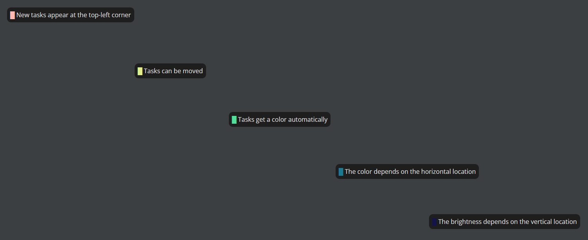

# Tasks Blackboard
Tasks Blackboard is a Chrome extension that displays tasks from Google Tasks on a blackboard.
The tasks can be moved around.
The color is based on the location on the board, so that groups of tasks are easily visible.



## Usage
* Browse to any Google service that has a Tasks window (Gmail, Calendar, ...)
* Open the Tasks window
* Click the Tasks Blackboard extension
* The Tasks Blackboard will now open

## Install
The extension has not been published to the Chrome Web Store.
Local installation is required.
```bash
npm install
./build.sh
```
Enable development mode and load the unpacked extension in the `/dist` folder.
